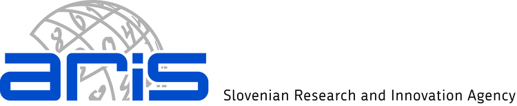

<!-- Intro box -->

  
<a href="https://www.gtgconference.eu/index.php" target="_blank">Gruppen und topologische Gruppen</a> is a 2-day international meeting devoted to recent developments in group theory. The next GtG meeting will be held at the Faculty of Mathematics and Physics (FMF) in Ljubljana (Slovenia).

  
The conference starts on Thursday, 23rd of January 2025, in the morning, and finishes on Friday, 24th of January, in the afternoon.

## Timetable

  <table style="width: 100%; border-collapse: collapse; text-align: center;">
    <thead>
      <tr style="background-color: #EAEAEA;">
        <th style="padding: 10px;"></th>
        <th style="padding: 10px;">Thursday </th>
        <th style="padding: 10px;">Friday </th>
      </tr>
    </thead>
    <tbody>
      <tr style="height: 50px;">
        <td>10:00 - 11:00</td>
        <td> Eberhard </td>
        <td> Fumagalli </td>
      </tr>
      <tr style="background-color: #F5F5F5;" style="height: 25px;">
        <td>11:00 - 11:30</td>
    <td class="break">Coffee Break</td>
         <td class="break">Coffee Break</td>
      </tr>
      <tr style="height: 50px;">
        <td>11:30 - 12:30</td>
        <td> Dona </td>
        <td> Bajpai </td>
      </tr>
      <tr style="background-color: #F5F5F5;" style="height: 25px;">
        <td>12:30 - 13:00</td>
        <td> Gaeta </td>
        <td>Serafini </td>
      </tr>
      <tr style="height: 75px;">
        <td>13:00- 14:30</td>
    <td class="break">Lunch </td>
        <td class="break">Lunch</td>
      </tr>
      <tr style="background-color: #F5F5F5;" style="height: 25px;">
        <td>14:30 - 15:00</td>
    <td> Fusari </td>
        <td> Otmen </td>
      </tr>
      <tr style="height: 25px;">
        <td>15:00 - 15:30 </td>
        <td> Sabatini </td>
        <td> Singh </td>
      </tr style="height: 25px;">
      <tr style="background-color: #F5F5F5;">
        <td>15:30 - 16:00</td>
         <td class="break">Coffee Break</td> 
         <td class="break">Coffee Break</td>
      </tr>
      <tr style="height: 25px;">
        <td>16:00 - 16:30</td>
        <td> Serwene </td>
        <td> Nicotera </td>
      </tr>
      <tr style="background-color: #F5F5F5;" style="height: 25px;">
        <td>16:30 - 17:00</td>
        <td> Figula </td>
        <td> Falcone </td>
      </tr>
    </tbody>
  </table>

<!-- Abstracts link -->

 Find the abstracts <a href="abstracts.pdf" target="_blank">[here]</a>.

The conference dinner will be on Friday at 19.00.

## Speakers

There will be four **invited talks** at the conference, given by:
- [Jitendra Bajpai](https://user.math.uni-kiel.de/%7Ejitendra/) (University of Kiel)
- [Daniele Dona](https://sites.google.com/view/danieledona/) (Alfred Renyi Institute of Mathematics)
- [Sean Eberhard](https://warwick.ac.uk/fac/sci/maths/people/staff/Eberhard) (University of Warwick)
- [Francesco Fumagalli](https://sites.google.com/unifi.it/fumagalli/) (Universita degli Studi di Firenze)

## Organised by

[Urban Jezernik](https://sites.google.com/site/urbanjezernik/), [Matevž Miščič](https://sites.google.com/view/matevzmiscic) and [Andoni Zozaya](https://sites.google.com/view/andonizozaya/orrialdea).

## Sponsors

<table style="width: 100%; text-align: center; margin: 0 auto;">
  <tr>
    <td style="padding-bottom: 10px;"><strong>Faculty of Mathematics and Physics</strong></td>
    <td style="padding-bottom: 10px;"><strong>Aris Research Project J1-50001</strong></td>
  </tr>
  <tr>
    <td></td>
    <td></td>
  </tr>
</table>

